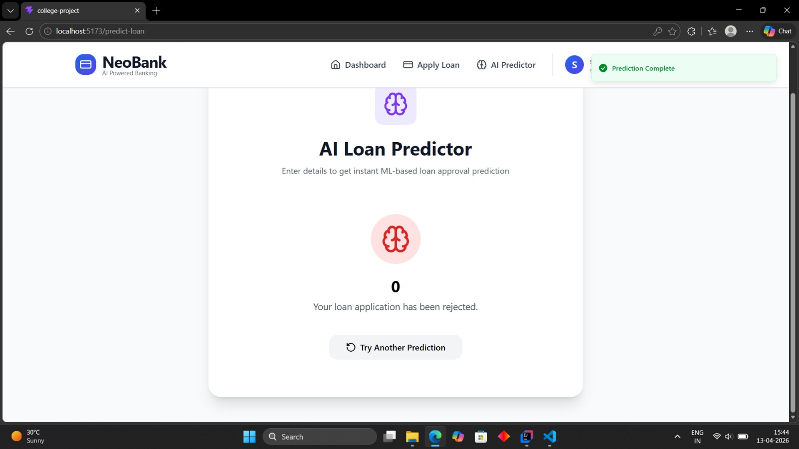

# Credit Prediction using Machine Learning

## Overview
This project leverages machine learning algorithms to predict credit risk and approval status. It provides a comprehensive solution combining data analysis, model training, and a full-stack web application for credit prediction.

## Technology Stack
- **Jupyter Notebook** : Data analysis and model experimentation
- **JavaScript** : Frontend interface
- **Java** : Backend services
- **Python** : Machine learning scripts
- **HTML/CSS/Other** : Web technologies

## System Architecture


The system consists of three main components:

### 1. **Frontend**
- Interactive user interface built with JavaScript
- Real-time credit prediction display
- User input forms for applicant information

### 2. **Backend**
- Java-based REST APIs
- ML model integration and serving
- Data processing and validation

### 3. **Machine Learning Pipeline**
- Data preprocessing and feature engineering
- Model training using various algorithms
- Prediction and scoring modules

## Directory Structure
```
Credit-prediction-using-Machine-Learning/
├── app/                    # Application files
├── backend/                # Java backend services
├── frontend/               # JavaScript frontend
├── model source files/     # ML model scripts and notebooks
├── images/                 # Diagrams and screenshots
└── README.md              # Project documentation
```

## Key Features
- ✅ Accurate credit risk assessment
- ✅ User-friendly web interface
- ✅ Scalable backend architecture
- ✅ Real-time predictions
- ✅ Comprehensive data analysis

## Installation & Setup

### Prerequisites
- Python 3.8+
- Node.js & npm
- Java 11+

### Steps
1. Clone the repository:
   ```bash
   git clone https://github.com/Vivek-krPatel/Credit-prediction-using-Machine-Learning.git
   cd Credit-prediction-using-Machine-Learning
   ```

2. Setup Backend:
   ```bash
   cd backend
   # Build and run Java application
   ```

3. Setup Frontend:
   ```bash
   cd frontend
   npm install
   npm start
   ```

4. Setup ML Models:
   ```bash
   cd "model source files"
   pip install -r requirements.txt
   jupyter notebook
   ```

## Usage

### Running the Application
1. Start the backend server
2. Launch the frontend application
3. Enter applicant details in the form
4. Click "Predict" to get credit assessment
5. View results and recommendations

### Training Models
Refer to Jupyter notebooks in the `model source files` directory for:
- Data exploration and visualization
- Model training and evaluation
- Hyperparameter tuning

## Screenshots

### Application Dashboard


### Model Results & Analysis


### Feature Engineering & Predictions



## Model Performance
The credit prediction model achieves high accuracy through:
- Ensemble learning techniques
- Cross-validation strategies
- Feature selection optimization
- Hyperparameter tuning

## Contributing
Contributions are welcome! Please feel free to submit pull requests or open issues for bugs and feature requests.

## License
This project is open source and available under the MIT License.

## Author
**Vivek Patel** - [GitHub Profile](https://github.com/Vivek-krPatel)
